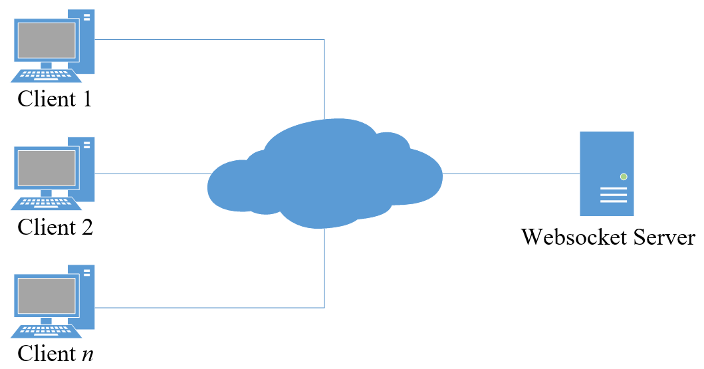
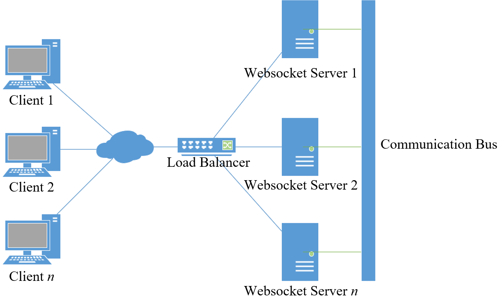
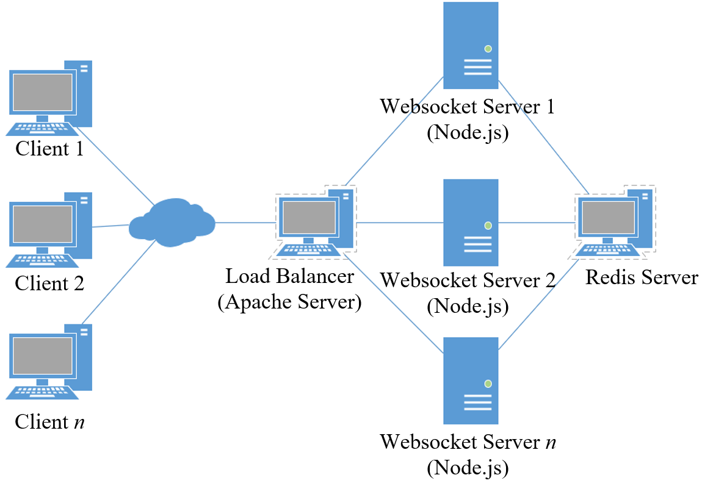
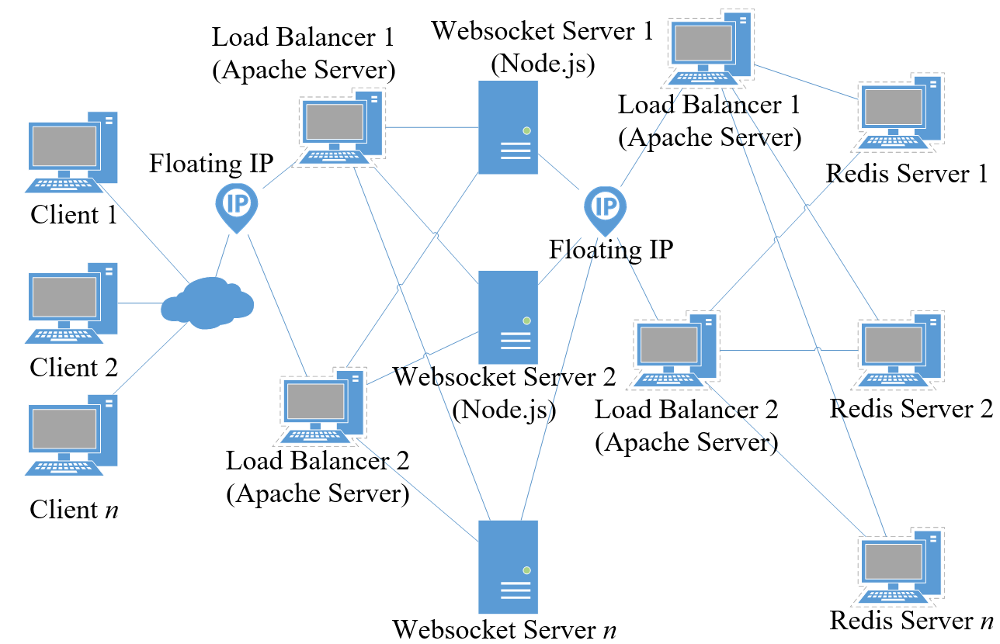
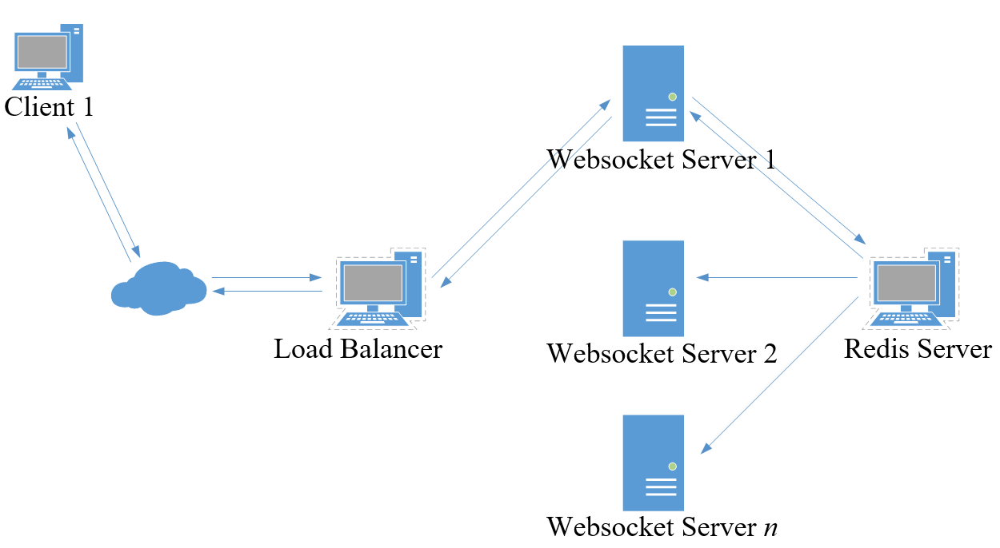
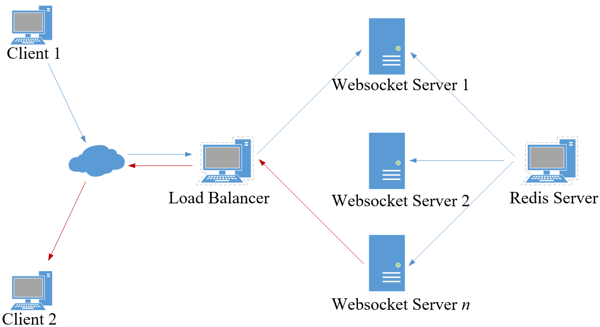

# Distributed Chat WebSocket
[](LICENSE)
[](https://twitter.com/amir_sayonara)

> Aplikasi Real Time Chat Terdistribusi Berbasis WebSocket Menggunakan Redis Server

> Ucapan terima kasih kepada Bapak [Husni](https://forlap.ristekdikti.go.id/dosen/detail/MTAzNkI5MTUtMDNFRi00RTA0LTgwODUtQjlCODkzMDg3Q0Yx) selaku Dosen Pembimbing kami

```
Kelompok:

> 160411100152	Natiq Hasbi Alim
> 160411100153	Moch. Amir
> 160411100170	Fajriatul Qur’ani

Mata Kuliah : Sistem Terdistribusi (B) - 2019
Jurusan     : Teknik Informatika
Dikti       : Universitas Trunojoyo Madura
```

[Copyright (c) 2019 Amir Sayonara](LICENSE)

> Tulisan ini hanya untuk bidang computer science. Terdapat istilah teknis yang mungkin akan membuat bingung kalau tidak paham dasarnya.

## Daftar Isi
- [Rancangan](#rancangan)
  * [Rancangan Umum (Tidak Terdistribusi)](#rancangan-umum-tidak-terdistribusi)
  * [Rancangan Terdistribusi (Multi Server)](#rancangan-terdistribusi-multi-server)
- [Proses Alur Data](#proses-alur-data)
  * [Proses Alur Koneksi](#proses-alur-koneksi)
  * [Proses Alur Pengiriman Pesan](#proses-alur-pengiriman-pesan)

## Rancangan
<p align="justify">Penjelasan dan rancangan dapat dilihat pada gambar-gambar dan keterangan di bawah ini:</p>

### Rancangan Umum (Tidak Terdistribusi)
<p align="justify">Rancangan WebSocket server sama seperti client-server pada umumnya. Terdapat satu buah server yang dapat diakses oleh banyak client. Karena WebSocket merupakan komunikasi dua arah, maka client yang terhubung akan ditahan agar siap melakukan komunikasi kapan saja pada saat terhubung. Server membuka port tertentu untuk menahan koneksi ini hingga salah satunya mengakhiri koneksi. Pada rancangan ini, jika satu buah server tersebut terjadi kegagalan sistem atau tidak dapat menahan koneksi lagi karena port yang digunakan sudah mendekati 65535 (jumlah maksimal port), maka client yang ingin terhubung sudah dipastikan tidak akan mendapat respon dari server.</p>
<p align="center"></p>
<p align="justify">Karena rancangan di atas memiliki kelemahan yang telah kami sebutkan, maka kami merancang agar server WebSocket tersebut dapat diperbanyak sehingga kegagalan sistem pada satu buah server atau kelebihan beban dapat ditangani selama server lainnya masih dapat berjalan normal.</p>

### Rancangan Terdistribusi (Multi Server)
<p align="justify">Rancangan yang ingin kami bangun adalah seperti pada gambar berikut:</p>
<p align="center"></p>
<p align="center"></p>
<p align="justify">Pada gambar di atas merupakan implementasi dasar dari rancangan terdistribusi pada WebSocket. Pada rancangan ini availability hanya ditangani oleh satu buah Load Balancer dan satu Redis. Hal ini akan menjadi masalah jika satu Load Balancer tersebut gagal beroperasi. Begitu juga pada saat Redis yang berfungsi sebagai penghubung antar server gagal beroperasi. Jika hal itu terjadi, maka sebanyak apapun server yang tersedia tidak akan berguna. Hal ini dapat diatasi dengan membangun lebih dari satu Load Balancer, begitu juga dengan Redis yang juga diharuskan lebih dari satu server. Untuk lebih jelasnya, dapat dilihat pada berikut:</p>
<p align="center"></p>
<p align="justify">Pada gambar di atas availability sistem dapat terjamin. Floating IP dapat diimplementasikan dengan memasang software yang bernama Keep Alive pada masing-masing Load Balancer. Software ini hanya tersedia pada sistem operasi Linux. IP yang diberikan kepada client adalah IP virtual yang dimiliki oleh kedua buah Load Balancer dan akan direspon oleh salah satu Load Balancer yang masih berjalan dengan normal. Hal ini berlaku juga pada Redis sebagai jalur penghubung antar server yang kami rancang dengan beberapa server. Khusus untuk Load Balancer pada Redis, metode yang digunakan harus konsisten. Seluruh WebSocket Server harus terhubung pada Redis server yang sama. Dengan demikian, sistem yang availability-nya hanya bergantung pada satu buah Load Balancer dan satu Redis, dapat teratasi dengan implementasi ini.</p>

## Proses Alur Data
<p align="justify">Penjelasan alur data dapat dilihat pada gambar-gambar dan keterangan di bawah ini:</p>

### Proses Alur Koneksi
<p align="center"></p>
<p align="justify">Alur proses pada gambar di atas, Client 1 me-request ke server WebSocket. Pada kenyataannya client tersebut tidak langsung me-request pada salah satu server yang ada. Tetapi client me-request ke Load Balancer. Kemudian Load Balancer yang akan memilihkan server untuk melayani request tersebut. Contoh pada Gambar 6 ini diteruskan ke server 1. Kemudian agar seluruh server mengetahui, maka server 1 akan mengirim informasi kepada Redis server agar di-broadcast ke seluruh server WebSocket yang ada. Terakhir, server 1 akan mengirim respon kepada Client 1. Hal ini sama halnya dengan proses pengiriman pesan dari salah satu client ke client lainnya.</p>

### Proses Alur Pengiriman Pesan
<p align="center"></p>
<p align="justify">Gambar di atas menjelaskan alur pada saat salah satu client mengirim pesan. Client 1 akan mengirim pesan kepada Client 2. Pada kasus ini Client 1 terhubung dengan WebSocket Server 1 dan Client 2 terhubung pada WebSocket Server 2. Pesan akan dikirim melalui Load Balancer dan diteruskan kepada WebSocket Server 1 yang terhubung pada client yang bersangkutan. Kemudian WebSocket Server 1 akan meneruskan pesan kepada jalur penghubung antar server (Redis) dan akan di-broadcast kepada seluruh WebSocket Server. WebSocket Server yang memiliki sambungan dengan Client 2 (Server n) akan merespon pesan (garis merah) dan mengirim kepada Load Balancer kembali untuk diteruskan kepada Client 2.</p>